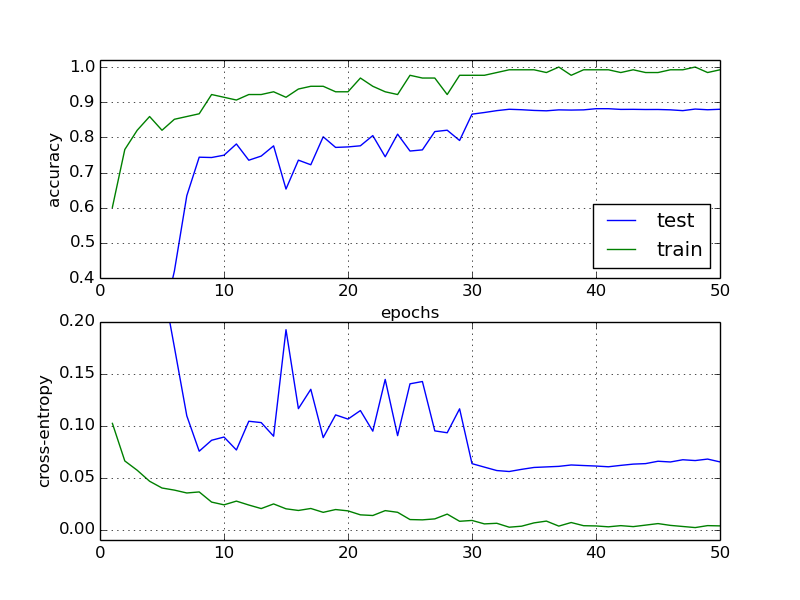

This is a sample implementation of ResNet-110 applied to CIFAR-10, see the [Deep Residual Learning for Image Recognition](https://arxiv.org/abs/1512.03385) paper for details. The original paper implementation using caffe can be found on [github](https://github.com/KaimingHe/deep-residual-networks).

This uses the python version of the [CIFAR-10 dataset](https://www.cs.toronto.edu/~kriz/cifar.html). Most implementation details should be similar to the reference paper/implementation.

* There is no ReLU at the end of residual blocks as suggested in this [blog post](http://torch.ch/blog/2016/02/04/resnets.html).
* The SGD optimizer is used with a momentum of 0.9. The initial learning rate is 0.1, it gets divided by 10 at epochs 30.
* Batch size is 128.
* A dropout with a keep probability of 0.8 is used for each convolution. Convolutions don't use any bias.

The resulting accuracy is 88.2% on CIFAR-10 without data augmentation. 

